<h2>Tensorflow-Image-Segmentation-Pancreas (2024/02/08)</h2>

This is an experimental Image Segmentation project for Pancreas based on
the <a href="https://github.com/sarah-antillia/Tensorflow-Image-Segmentation-API">Tensorflow-Image-Segmentation-API</a>.
 
As a first trial, we use the simple UNet Model 
<a href="./src/TensorflowUNet.py">TensorflowSlightlyFlexibleUNet</a> for this Pancreas Segmentation. 
As shown in <a href="https://github.com/sarah-antillia/Tensorflow-Image-Segmentation-API">Tensorflow-Image-Segmentation-API</a>.
you may try other Tensorflow UNet Models: 

<li><a href="./src/TensorflowSwinUNet.py">TensorflowSwinUNet.py</a></li>
<li><a href="./src/TensorflowMultiResUNet.py">TensorflowMultiResUNet.py</a></li>
<li><a href="./src/TensorflowAttentionUNet.py">TensorflowAttentionUNet.py</a></li>
<li><a href="./src/TensorflowEfficientUNet.py">TensorflowEfficientUNet.py</a></li>
<li><a href="./src/TensorflowUNet3Plus.py">TensorflowUNet3Plus.py</a></li>
 

<h3>1. Dataset Citation</h3>

The original image dataset used here has been taken from the following kaggle.com web site. 
<a href="https://www.kaggle.com/datasets/salihayesilyurt/pancreas-ct">
Pancreas-CT</a> 
Created by Sean Berryman, last modified by Tracy Nolan on Sep 16, 2020 
 
<b>About Dataset</b> 
Summary: 
<pre>
The National Institutes of Health Clinical Center performed 82 abdominal contrast enhanced 3D CT 
scans (~70 seconds after intravenous contrast injection in portal-venous) from 53 male and 27 
female subjects. Seventeen of the subjects are healthy kidney donors scanned prior to nephrectomy. 
The remaining 65 PANCREAS_s were selected by a radiologist from PANCREAS_s who neither had major 
abdominal pathologies nor pancreatic cancer lesions. Subjects' ages range from 18 to 76 years with 
a mean age of 46.8 ± 16.7. The CT scans have resolutions of 512x512 pixels with varying pixel sizes 
and slice thickness between 1.5 − 2.5 mm, acquired on Philips and Siemens MDCT scanners 
(120 kVp tube voltage).

A medical student manually performed slice-by-slice segmentations of the pancreas as ground-truth 
and these were verified/modified by an experienced radiologist.
</pre>
Reference: https://wiki.cancerimagingarchive.net/display/Public/Pancreas-CT 

<a href="./projects/TensorflowSlightlyFlexibleUNet/Pancreas/LICENSE">LICENSE</a>

 

<h3>
<a id="2">
2 Pancreas ImageMask Dataset
</a>
</h3>
 If you would like to train this Pancreas Segmentation model by yourself,
 please download the dataset from the google drive 
<a href="https://drive.google.com/file/d/1Q7cDMSQgtXgZJjg-xIiFHmXOyNn3vio1/view?usp=sharing">
PPancreas-ImageMask-Dataset_V1.0.zip.</a>

Please see also the <a href="https://github.com/atlan-antillia/Pancreas-ImageMask-Dataset">Pancreas-ImageMask-Dataset</a>. 
Please expand the downloaded ImageMaskDataset and place them under <b>./dataset</b> folder to be

<pre>
./dataset
└─Pancreas
    ├─test
    │  ├─images
    │  └─masks
    ├─train
    │  ├─images
    │  └─masks
    └─valid
        ├─images
        └─masks
</pre>
 
 
<b>Pancreas Dataset Statistics</b> 
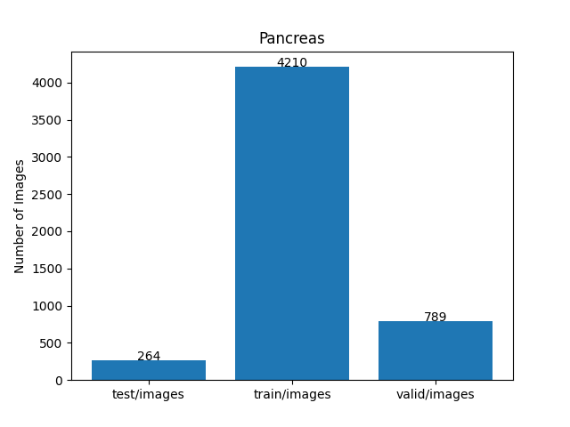 

 

<h3>
<a id="3">
3 TensorflowSlightlyFlexibleUNet
</a>
</h3>
This <a href="./src/TensorflowUNet.py">TensorflowUNet</a> model is slightly flexibly customizable by a configuration file. 
For example, <b>TensorflowSlightlyFlexibleUNet/Pancreas</b> model can be customizable
by using <a href="./projects/TensorflowSlightlyFlexibleUNet/Pancreas/train_eval_infer.config">
train_eval_infer.config.</a>
<pre>
; train_eval_infer.config
; 2024/02/06 (C) antillia.com

[model]
model          = "TensorflowUNet"
#datasetclass   = "ImageMaskDataset"

image_width    = 512
image_height   = 512
image_channels = 3
num_classes    = 1
base_filters   = 16
num_layers     = 7
dropout_rate   = 0.08
learning_rate  = 0.0001

loss           = "bce_iou_loss"
;loss           = "binary_crossentropy"
metrics        = ["binary_accuracy"]
show_summary   = False

[train]
epochs        = 100
batch_size    = 4
patience      = 10
metrics       = ["binary_accuracy", "val_binary_accuracy"]

model_dir     = "./models"
eval_dir      = "./eval"

image_datapath = "../../../dataset/Pancreas/train/images/"
mask_datapath  = "../../../dataset/Pancreas/train/masks/"

[eval]
image_datapath = "../../../dataset/Pancreas/valid/images/"
mask_datapath  = "../../../dataset/Pancreas/valid/masks/"

[infer] 
images_dir    = "../../../dataset/Pancreas/test/images/"
output_dir    = "./test_output"
merged_dir    = "./test_output_merged"

[mask]
blur      = True
blur_size = (5,5)
binarize  = True
threshold = 128
</pre>

<h3>
3.1 Training
</h3>
Please move to a <b>./projects/TensorflowSlightlyFlexibleUNet/Pancreas</b> directory, 
and run the following bat file to train TensorflowUNet model for Pancreas. 
<pre>
./1.train.bat
</pre>
<pre>
python ../../../src/TensorflowUNetTrainer.py ./train_eval_infer.config
</pre>
Train console output: 
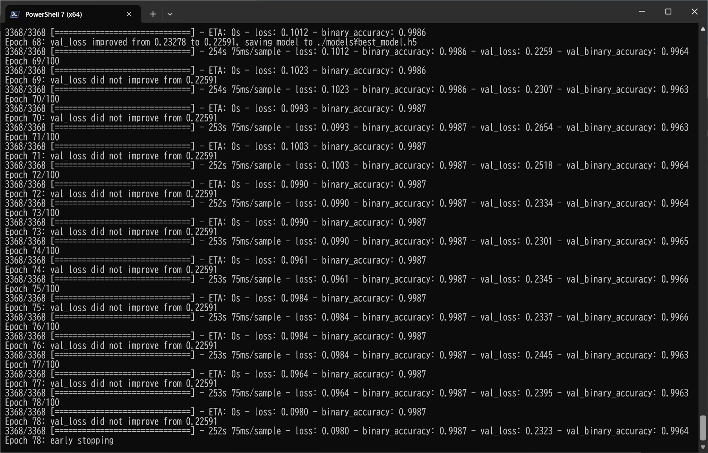 
Train metrics: 
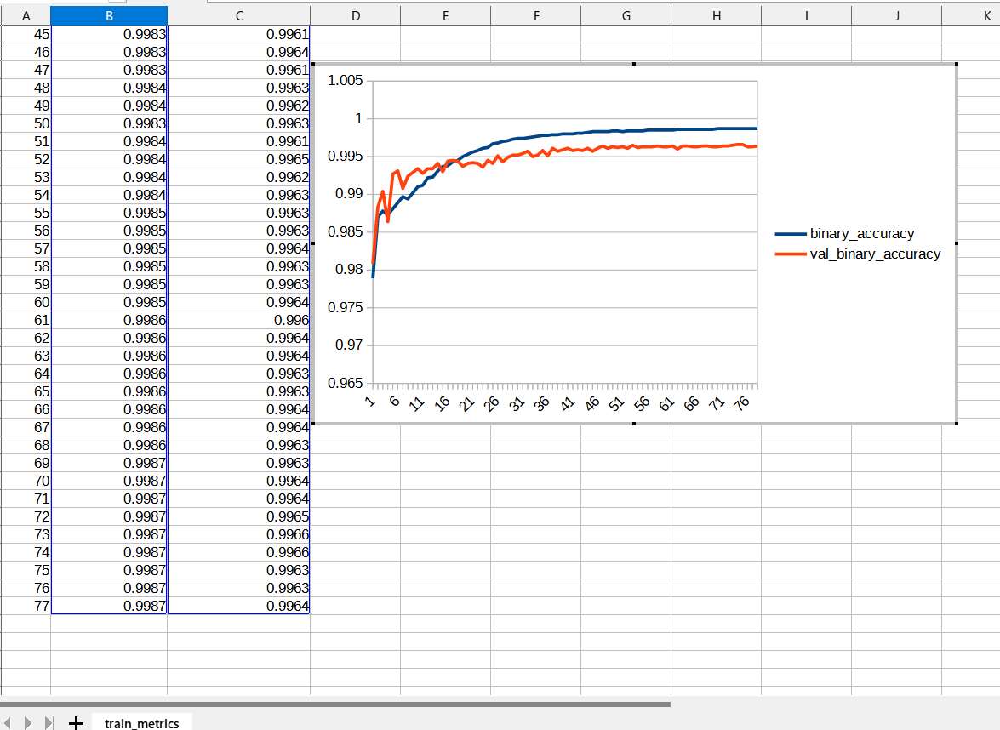 
Train losses: 
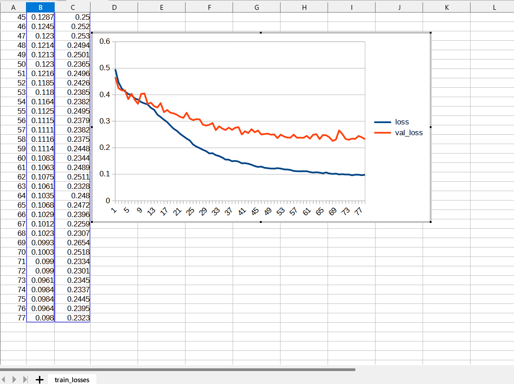 
 
<h3>
3.2 Evaluation
</h3>
Please move to a <b>./projects/TensorflowSlightlyFlexibleUNet/Pancreas</b> folder, 
and run the following bat file to evaluate TensorflowUNet model for Pancreas. 
<pre>
./2.evaluate.bat
</pre>
<pre>
python ../../../src/TensorflowUNetEvaluator.py ./train_eval_infer.config
</pre>
Evaluation console output: 
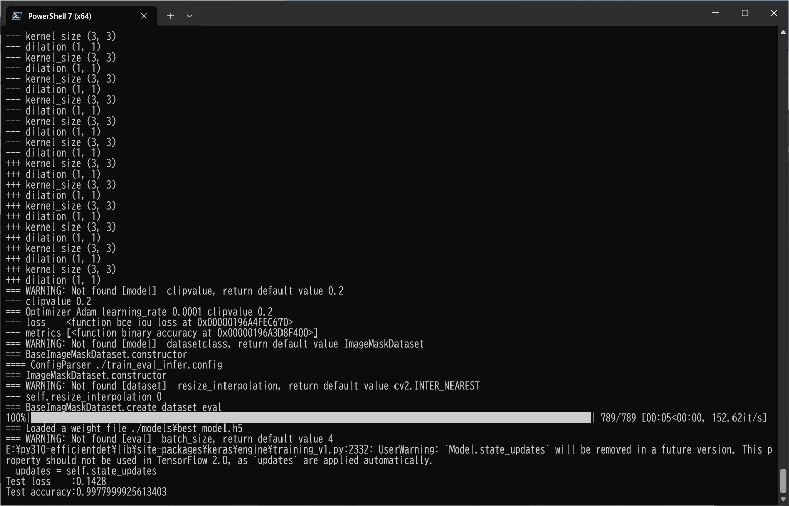 

<h2>
3.3 Inference
</h2>
Please move to a <b>./projects/TensorflowSlightlyFlexibleUNet/Pancreas</b> folder 
,and run the following bat file to infer segmentation regions for images by the Trained-TensorflowUNet model for Pancreas. 
<pre>
./3.infer.bat
</pre>
<pre>
python ../../../src/TensorflowUNetInferencer.py ./train_eval_infer.config
</pre>
Sample test images 
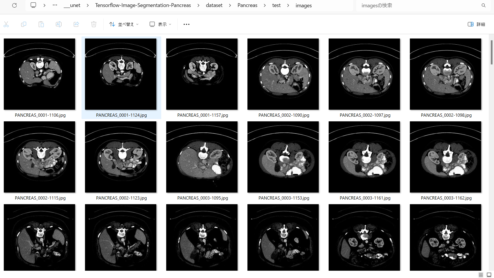 
Sample test mask 
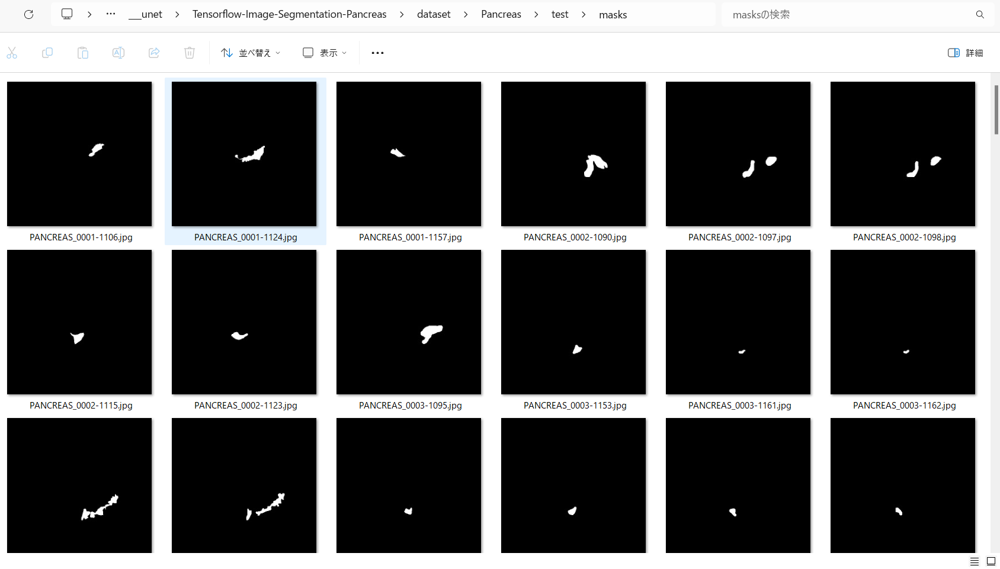 

 
Inferred test masks 
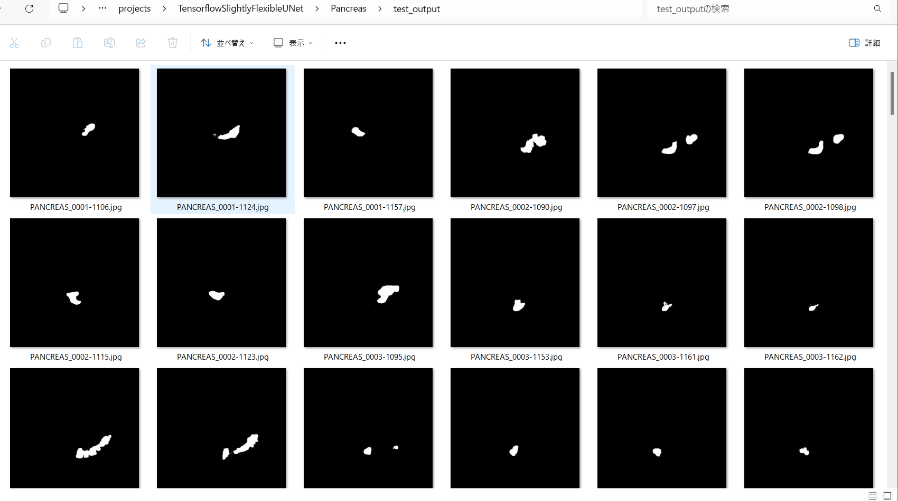 
 
Merged test images and inferred masks  
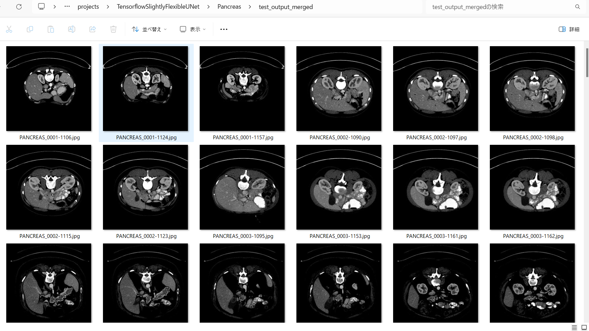  

Enlarged samples 
<table>
<tr>
<td>
test/images/PANCREAS_0001-1106.jpg 
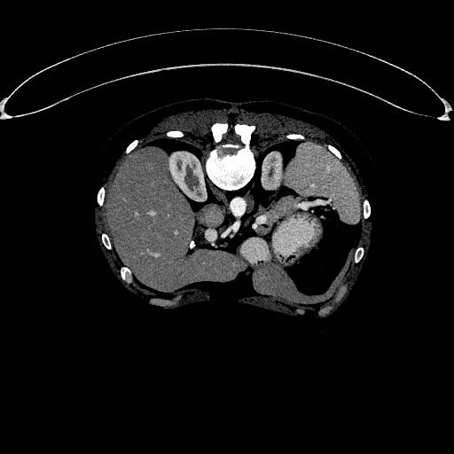

</td>
<td>
Inferred merged/PANCREAS_0001-1106.jpg 

</td> 
</tr>

<tr>
<td>
test/images/PANCREAS_0002-1090.jpg 
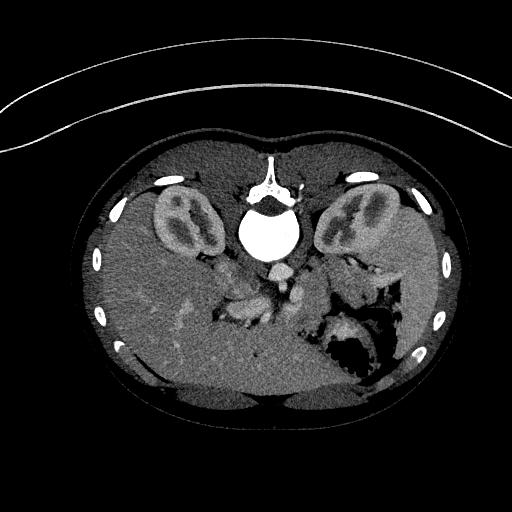

</td>
<td>
Inferred merged/PANCREAS_0002-1090.jpg 
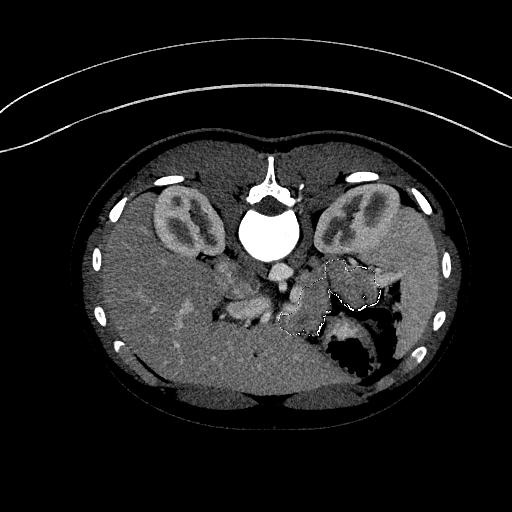
</td> 
</tr>

<tr>
<td>
test/images/PANCREAS_0005-1092.jpg 
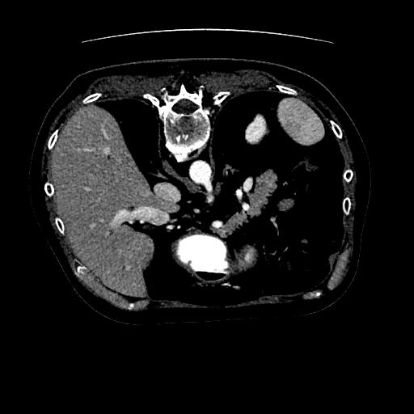

</td>
<td>
Inferred merged/PANCREAS_0005-1092.jpg 

</td> 
</tr>

<tr>
<td>
test/images/PANCREAS_0032-1129.jpg 
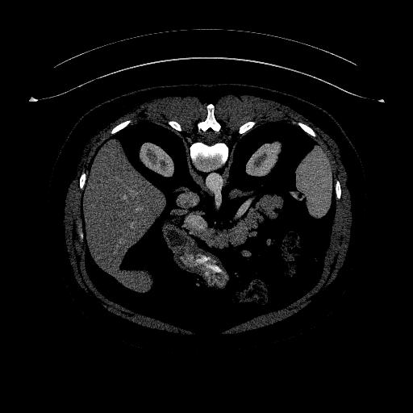

</td>
<td>
Inferred merged/PANCREAS_0032-1129.jpg 
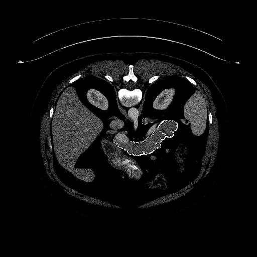
</td> 
</tr>

<tr>
<td>
test/images/PANCREAS_0045-1097.jpg 
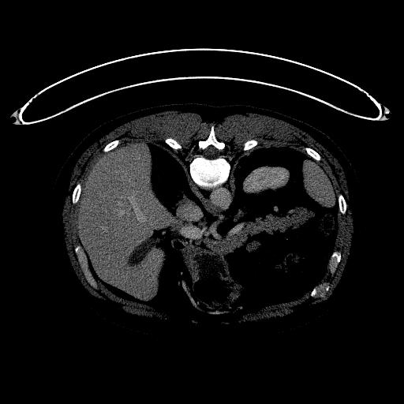

</td>
<td>
Inferred merged/PANCREAS_0045-1097.jpg 
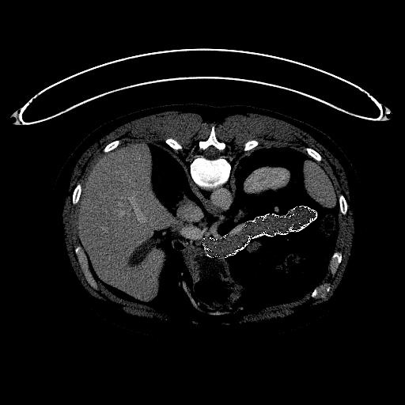
</td> 
</tr>

</table>

<h3>
References
</h3>

<b>1. Accurate pancreas segmentation using multi-level pyramidal pooling residual U-Net with adversarial mechanism</b> 
Li, M., Lian, F., Wang, C. et al.  
BMC Med Imaging 21, 168 (2021). https://doi.org/10.1186/s12880-021-00694-1 
<pre>
https://bmcmedimaging.biomedcentral.com/articles/10.1186/s12880-021-00694-1
</pre>

<b>2. Automated pancreas segmentation and volumetry using deep neural network on computed tomography</b> 
Sang-Heon Lim, Young Jae Kim, Yeon-Ho Park, Doojin Kim, Kwang Gi Kim & Doo-Ho Lee 
Sci Rep 12, 4075 (2022). https://doi.org/10.1038/s41598-022-07848-3 
<pre>
https://www.nature.com/articles/s41598-022-07848-3#Sec11
</pre>

